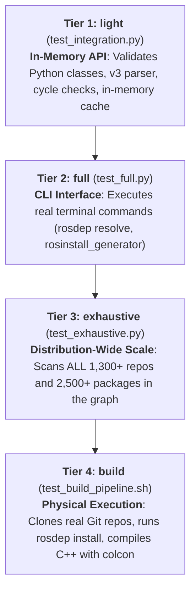

# ROS Distribution Extension Test Suite (REP-2015)

[](https://github.com/KmoM88/test-rosdistro-rep2015/actions/workflows/ci.yaml)

This repository serves as a dedicated, standalone integration test environment to validate the modifications implemented in `rosdistro`, `rosdep`, and `rosinstall_generator` to support [REP-2015](https://ros.org/reps/rep-2015.html) (ROS Distribution Extensions).

The test suite validates cross-distribution inheritance by using **`lyrical`** (a downstream ROS 2 distribution from the user fork) directly extending **`jetty`** (a custom upstream Gazebo distribution) using the `source_rebuild` extension method.

---

## Repository Architecture

This repository operates completely autonomously using the following Git submodules:

* **`submodules/rosdistro`**: Fork of `rosdistro` on branch `feature/rep-2015-v3-parser` containing the Version 3 distribution file parser, circular inheritance validation, platform compatibility checks, repository specification merging, and chained in-memory cache resolution.
* **`submodules/rosdep`**: Fork of `rosdep` on branch `feature/rep-2015-tool-integration` supporting REP-2015 distribution prefix translation for `source_rebuild` and `binary_import`.
* **`submodules/rosinstall_generator`**: Fork of `rosinstall_generator` on branch `feature/rep-2015-tool-integration` querying chained distribution caches across distribution boundaries.
* **`submodules/gazebodistro`**: Custom Gazebo package repository on branch `jrivero/jetty-rosdistro` containing the base `jetty` package specifications.
* **`submodules/ros-rosdistro`**: Fork of `rosdistro` distribution metadata on branch `feature/rep-2015-jetty-extension` containing the downstream `lyrical` distribution configured with format version 3 and extending `jetty`.

---

## Getting Started

Clone this repository with the `--recursive` flag to pull all required toolchains and metadata submodules:

```bash
git clone --recursive https://github.com/KmoM88/test-rosdistro-rep2015.git
cd test-rosdistro-rep2015
```

If you already cloned without `--recursive`:
```bash
git submodule update --init --recursive
```

---

## Running the Tests

You can execute the test suite either inside an isolated Docker container (recommended) or manually on the host machine.

### Method 1: Using the Automated Docker Script (Recommended)

Run the test runner specifying the desired test mode:

```bash
# Tier 1: Run light in-memory test suite (test_integration.py)
./run_tests.sh
# or explicitly:
./run_tests.sh light

# Tier 2: Run full end-to-end CLI test suite (test_full.py)
./run_tests.sh full

# Tier 3: Run exhaustive distribution scan across all 1,300+ repos (test_exhaustive.py)
./run_tests.sh exhaustive

# Tier 4: Run real source checkout & colcon build pipeline (test_build_pipeline.sh)
./run_tests.sh build
# or build specific packages:
./run_tests.sh build gz-cmake gz-tools2
# or build the entire distribution from source:
./run_tests.sh build --all
```

---

### Method 2: Manual Step-by-Step Execution inside Docker

If you prefer to inspect and run each step manually inside the container:

1. **Build the Docker container image**:
   ```bash
   docker build -t test-rosdistro-rep2015 -f Dockerfile .
   ```

2. **Start an interactive container session**:
   ```bash
   docker run --rm -it test-rosdistro-rep2015 bash
   ```

3. **Execute the integration test suite**:
   ```bash
   /workspace/.venv/bin/python3 /workspace/test_integration.py
   ```

4. **Verify individual tools interactively**:
   ```bash
   export ROSDISTRO_INDEX_URL="file:///workspace/index.yaml"
   
   # Test rosinstall_generator resolving an inherited Gazebo package under lyrical:
   .venv/bin/rosinstall_generator gz-sim --rosdistro lyrical --upstream
   
   # Test rosdep database dump:
   .venv/bin/rosdep db | grep -A 5 "ros-lyrical-turtlesim"
   ```

---

### Method 3: Manual Step-by-Step Execution on the Host Machine

To run the tests directly on your host environment (Ubuntu / Linux):

1. **Create and activate a Python virtual environment**:
   ```bash
   python3 -m venv .venv
   source .venv/bin/activate
   pip install --upgrade pip
   ```

2. **Install the modified submodules in editable mode (`-e`)**:
   ```bash
   pip install -e submodules/rosdistro[test]
   pip install -e submodules/rosdep[test]
   pip install -e submodules/rosinstall_generator
   ```

3. **Initialize `rosdep` (if not already initialized on the host)**:
   ```bash
   export ROSDEP_LOCAL_DEV=true
   rosdep init || true
   rosdep update || true
   ```

4. **Export the test index URL pointing to the local `index.yaml`**:
   ```bash
   export ROSDISTRO_INDEX_URL="file://$(pwd)/index.yaml"
   ```

5. **Run the integration test script**:
   ```bash
   python3 test_integration.py
   ```

---

## Expected Outputs Reference

Below are representative reference outputs for each of the test execution tiers:

### 1. `light` Mode (`test_integration.py` / `./run_tests.sh light`)
```text
============================================================
Testing REP-2015 Extension: Lyrical extending Gazebo Jetty
Using index: file:///workspace/index.yaml
============================================================

[1/3] Testing rosdistro distribution inheritance and resolution...
WARNING: Target platform 'debian:trixie' specified in derived distribution is not supported by base distribution.
WARNING: Target platform 'fedora:43' specified in derived distribution is not supported by base distribution.
WARNING: Target platform 'rhel:10' specified in derived distribution is not supported by base distribution.
WARNING: Target platform 'ubuntu:resolute' specified in derived distribution is not supported by base distribution.
 -> rosdistro distribution file inheritance verified successfully.

[2/3] Testing rosdistro chained in-memory cache resolution...
 -> rosdistro in-memory chained cache verified successfully.

[3/3] Testing rosinstall_generator repository resolution across distro boundaries...
Generated rosinstall entry:
- git:
    local-name: gz-sim
    uri: https://github.com/gazebosim/gz-sim
    version: 10.5.0
 -> rosinstall_generator resolved inherited Gazebo source successfully.

[4/4] Testing rosdep package resolutions under source_rebuild...
Query rosdistro index file:///workspace/index.yaml
Add distro "jetty"
Add distro "lyrical"
 -> lyrical turtlesim resolves to: ['ros-lyrical-turtlesim']
 -> lyrical std_msgs resolves to: ['ros-lyrical-std-msgs']
 -> lyrical ros_gz_sim resolves to: ['ros-lyrical-ros-gz-sim']
 -> lyrical ros_gz_bridge resolves to: ['ros-lyrical-ros-gz-bridge']
 -> rosdep package prefix resolutions verified successfully.

============================================================
ALL REP-2015 EXTENSION TESTS PASSED SUCCESSFULLY!
============================================================
```

---

### 2. `full` Mode (`test_full.py` / `./run_tests.sh full`)
```text
======================================================================
RUNNING FULL END-TO-END CLI TEST (LYRICAL EXTENDING JETTY)
Index URL: file:///workspace/index.yaml
======================================================================

[1/3] Testing standard CLI rosinstall_generator across distro boundaries...
  -> rosinstall_generator gz-sim: PASSED
  -> rosinstall_generator gz-transport: PASSED
  -> rosinstall_generator sdformat: PASSED

[2/3] Testing standard CLI rosdep resolution (Ubuntu Resolute)...
  -> rosdep resolve std_msgs -> ros-lyrical-std-msgs: PASSED
  -> rosdep resolve turtlesim -> ros-lyrical-turtlesim: PASSED
  -> rosdep resolve ros_gz_sim -> ros-lyrical-ros-gz-sim: PASSED
  -> rosdep resolve ros_gz_bridge -> ros-lyrical-ros-gz-bridge: PASSED

[3/3] Testing chained distribution cache resolution...
  -> Chained multi-distribution cache verified successfully.

======================================================================
ALL FULL END-TO-END TESTS PASSED SUCCESSFULLY!
======================================================================
```

---

### 3. `exhaustive` Mode (`test_exhaustive.py` / `./run_tests.sh exhaustive`)
```text
======================================================================
RUNNING EXHAUSTIVE DISTRIBUTION TEST (SCANNING ALL PACKAGES)
Index URL: file:///workspace/index.yaml
======================================================================

[1/3] Parsing and resolving complete distribution graph for 'lyrical'...
  -> Total Repositories: 1380
  -> Local Lyrical Repositories: 1353
  -> Inherited Upstream Repositories (source_rebuild): 27
  -> Sample Inherited Gazebo Repositories (27): ['gz-cmake', 'gz-common', 'gz-fuel-tools', 'gz-gui', 'gz-math']...

[2/3] Validating all release packages...
  -> Total Release Packages: 2541

[3/3] Generating full rosdep Debian translation table for all packages...
  -> Total Resolved rosdep Keys: 2541
  -> Verified std_msgs -> ['ros-lyrical-std-msgs']
  -> Verified turtlesim -> ['ros-lyrical-turtlesim']
  -> Verified ros_gz_sim -> ['ros-lyrical-ros-gz-sim']
  -> Verified ros_gz_bridge -> ['ros-lyrical-ros-gz-bridge']

======================================================================
EXHAUSTIVE TEST PASSED! Scanned 1380 repos & 2541 packages in 22.45s
======================================================================
```

---

### 4. `build` Mode (`test_build_pipeline.sh` / `./run_tests.sh build`)
```text
==========================================================
Starting Complete End-to-End Build Pipeline
Target packages: gz-cmake via lyrical
==========================================================

[1/4] Generating rosinstall specification using rosinstall_generator...
- git:
    local-name: gz-cmake
    uri: https://github.com/gazebosim/gz-cmake
    version: gz-cmake5_5.1.1

[2/4] Cloning source checkout using vcstool...
=== src/gz-cmake (git) ===
Cloning into '.'...
Note: switching to 'gz-cmake5_5.1.1'.
HEAD is now at b71b379 Prepare for 5.1.1 release (#558)

[3/4] Resolving and verifying dependencies with rosdep...
# All required rosdeps satisfied

[4/4] Building packages from source with colcon...
Starting >>> gz-cmake
Finished <<< gz-cmake [2.31s]

Summary: 1 package finished [2.45s]

==========================================================
COMPLETE BUILD PIPELINE SUCCEEDED!
Target packages (gz-cmake) successfully built in /workspace/build_ws/install
==========================================================
```

---

## Detailed Breakdown: What is Tested

### 1. `rosdistro`
* **Version 3 Schema Parsing**: Parses distribution files declaring `type: distribution` and `version: 3`.
* **Inheritance & Loop Prevention**: Validates the `extends` directive and detects potential circular inheritance graphs.
* **Platform Compatibility Warnings**: Validates target platforms of derived distributions against base platforms. When `lyrical` specifies platforms exceeding `jetty` (`noble` vs `trixie`, `resolute`, etc.), `rosdistro` issues descriptive warnings without crashing.
* **Repository Specification Merging**: Merges parent repository specifications into the child repository so child distributions inherit source Git URLs while defining local release versions.
* **Chained Cache Resolution**: Resolves multi-tier distribution caches dynamically in-memory without requiring flattened, duplicated on-disk cache files.

### 2. `rosinstall_generator`
* **Cross-Distribution Querying**: Queries package names across chained distribution boundaries using `--rosdistro lyrical`.
* **Upstream Git Checkout Generation**: Successfully extracts the Git repository URL (`https://github.com/gazebosim/gz-sim`) and version tag (`10.5.0`) for `gz-sim` (which is inherited from `jetty`) and formats it as a `.rosinstall` YAML block.

### 3. `rosdep`
* **Package Prefix Translation**: Validates the modified `rosdep` naming logic in `gbpdistro_support.py`.
* **`source_rebuild` Renaming**: Under `source_rebuild`, packages rebuilt into the downstream environment are renamed with the downstream prefix (`ros-lyrical-*`):
  * `turtlesim` $\rightarrow$ `ros-lyrical-turtlesim`
  * `std_msgs` $\rightarrow$ `ros-lyrical-std-msgs`
  * `ros_gz_sim` $\rightarrow$ `ros-lyrical-ros-gz-sim`
  * `ros_gz_bridge` $\rightarrow$ `ros-lyrical-ros-gz-bridge`

---

## Toolchain Fork Modifications (Differences vs. Upstream)

To enable REP-2015 cross-distribution inheritance and tag resolution, specific targeted modifications were implemented in the forks of `rosinstall_generator` and `rosdep` compared to their upstream repositories:

### 1. `rosinstall_generator` (`src/rosinstall_generator/generator.py`)

#### Code Diff:
```python
 def generate_rosinstall_for_repos(repos, version_tag=True, tar=False):
     rosinstall_data = []
     for repo in repos.values():
         if version_tag:
-            version = repo.release_repository.version.split('-')[0]
+            if hasattr(repo.release_repository, 'tags') and repo.release_repository.tags and 'release' in repo.release_repository.tags:
+                version = repo.release_repository.get_release_tag(repo.name)
+            else:
+                version = repo.release_repository.version.split('-')[0]
             vcs_type = repo.release_repository.type
         else:
             version = repo.source_repository.version
```

#### Why this change was needed:
* **Upstream Assumption**: Upstream `rosinstall_generator` assumed releases were tagged simply by the bare version number (`5.1.1-2` became `5.1.1`).
* **The Problem in Extended Distributions**: Gazebo (and other non-ROS or multi-major projects in REP-143 distributions) defines custom release tag templates: `tags: {release: 'gz-cmake5_{upstream_version}'}`. On GitHub, the tag is `gz-cmake5_5.1.1` (tag `5.1.1` does not exist), which causes `vcstool` / `git checkout` to fail.
* **The Fix**: The fork checks if `tags['release']` is specified and invokes `repo.release_repository.get_release_tag(repo.name)` to resolve the evaluated Git tag.

---

### 2. `rosdep` (`src/rosdep2/gbpdistro_support.py` & `setup.py`)

#### Code Diff (`gbpdistro_support.py`):
```python
             # - package name: underscores must be dashes
-            package_name = 'ros-%s-%s' % (release_name, pkg)
+            origin_distro = getattr(repo, 'origin_distro', release_name)
+            extension_method = getattr(repo, 'extension_method', None)
+            if extension_method == 'binary_import' and origin_distro != release_name:
+                pkg_distro = origin_distro
+            else:
+                pkg_distro = release_name
+            package_name = 'ros-%s-%s' % (pkg_distro, pkg)
             package_name = package_name.replace('_', '-')
```

#### Code Diff (`setup.py`):
```python
-    kwargs['install_requires'] += ['catkin_pkg >= 0.4.0', 'rospkg >= 1.4.0', 'rosdistro >= 0.7.5']
+    rosdistro_dep = 'rosdistro @ git+https://github.com/KmoM88/rosdistro.git@feature/rep-2015-v3-parser'
+    if os.environ.get('ROSDEP_LOCAL_DEV') == 'true':
+        rosdistro_dep = 'rosdistro'
+    kwargs['install_requires'] += ['catkin_pkg >= 0.4.0', 'rospkg >= 1.4.0', rosdistro_dep]
```

#### Why this change was needed:
* **Upstream Assumption**: Upstream `rosdep` always prefixed Debian packages unconditionally with the name of the queried distribution (`ros-%s-%s % (release_name, pkg)`), always resulting in `ros-lyrical-*`.
* **The REP-2015 Invariant**:
  * Under **`binary_import`**: The package is pre-compiled in the base distribution (`/opt/ros/jetty`). It **must retain the base prefix** (`ros-jetty-*`).
  * Under **`source_rebuild`**: The package is recompiled into the derived distribution (`/opt/ros/lyrical`). It **must receive the child prefix** (`ros-lyrical-*`).
* **The Fix**: The fork inspects the `extension_method` and `origin_distro` metadata populated by the modified `rosdistro` parser and assigns the package prefix accordingly.

---

## Test Progression & Execution Modes (`light` $\rightarrow$ `full` $\rightarrow$ `exhaustive` $\rightarrow$ `build`)

The test suite is structured as a **progressive verification pyramid**: each tier builds upon the guarantees of the previous level, moving from fast in-memory Python models up to physical C++ source code compilation:



---

### Tier 1: `light` (`test_integration.py`)
* **Focus**: **In-Memory Python API & Data Models**
* **Command**: `./run_tests.sh light` (or `./run_tests.sh`)
* **Execution Time**: ~10 seconds (hermetic & fast).
* **What it tests**:
  1. **Schema & Inheritance Logic**: Calls `rosdistro.get_distribution_file(index, 'lyrical')` to verify that Version 3 distribution files correctly parse `extends: jetty`, detect circular dependency trees, and issue platform compatibility warnings.
  2. **In-Memory Chained Caching**: Calls `rosdistro.get_cached_distribution(...)` to ensure the child cache dynamically loads and merges the parent cache in memory without duplicating cache files on disk.
  3. **Internal Renaming Logic**: Directly tests internal Python methods (`get_gbprepo_as_rosdep_data`) to verify that package name translation (`ros-lyrical-*`) works in memory.
* **Purpose**: Fast feedback loop for developers modifying internal Python code in `rosdistro` or `rosdep`.

---

### Tier 2: `full` (`test_full.py`)
* **Focus**: **End-User CLI Tools via Bash Subprocesses**
* **Command**: `./run_tests.sh full`
* **Execution Time**: ~15 seconds.
* **How it steps forward from `light`**:
  * While `light` tests internal Python methods, `full` tests the **actual command-line executables** that users run in their terminal:
    ```bash
    rosinstall_generator gz-sim gz-transport sdformat --rosdistro lyrical --upstream
    rosdep resolve std_msgs --rosdistro lyrical --os=ubuntu:resolute
    rosdep resolve ros_gz_sim --rosdistro lyrical --os=ubuntu:resolute
    ```
  * Verifies stdout text, return codes, and ensures that cross-distribution boundaries are completely transparent to end-users typing standard CLI commands.
* **Purpose**: Proves the CLI tools work as expected in a developer's terminal without requiring any Python scripting or monkey-patching.

---

### Tier 3: `exhaustive` (`test_exhaustive.py`)
* **Focus**: **Distribution-Wide Scale & Metadata Integrity**
* **Command**: `./run_tests.sh exhaustive`
* **Execution Time**: ~25 seconds.
* **How it steps forward from `full`**:
  * `full` validates a curated sample of 4–5 packages (`std_msgs`, `turtlesim`, `ros_gz_sim`, `gz-sim`).
  * `exhaustive` removes sampling and iterates over **every single repository and package in the entire distribution**:
    * **1,300+ repositories**: verifies origin distribution tagging (`origin_distro: jetty`) and extension methods (`source_rebuild`).
    * **2,500+ release packages**: generates the full distribution-wide `rosdep` Debian translation table to ensure there are no naming collisions, missing dependencies, or orphaned parent packages.
* **Purpose**: Guarantees that the extension scales across an entire real-world distribution without edge cases hidden in un-sampled packages.

---

### Tier 4: `build` (`test_build_pipeline.sh`)
* **Focus**: **Real Network Checkout, Dependency Installation & C++ Compilation**
* **Command**: `./run_tests.sh build` (or `./run_tests.sh build --all`)
* **Execution Time**: ~30 seconds for `gz-cmake`, or hours for `--all`.
* **How it steps forward from `exhaustive`**:
  * Previous tiers only inspected **metadata** (YAML files, tags, and strings). They never downloaded source code or invoked a compiler.
  * `build` proves that the metadata produces **actual working software on disk**:
    1. `rosinstall_generator` resolves the exact evaluated Git tag (`gz-cmake5_5.1.1`).
    2. `vcstool` (`vcs import`) reaches out to GitHub over the network, clones the repository, and checks out the commit.
    3. `rosdep install` verifies system dependencies for the cloned source.
    4. `colcon build --symlink-install` compiles the C++ / CMake code and installs valid modules into `/workspace/build_ws/install/`.
* **Purpose**: The ultimate proof that the entire chain—from distribution YAML files to compiled binaries—works end-to-end.

---

### Progression Summary Table

| Tier | Script | Target Tested | Network / Disk Action | Execution Time |
| :--- | :--- | :--- | :--- | :--- |
| **`light`** | `test_integration.py` | Python classes & parser methods | None (pure in-memory) | ~10s |
| **`full`** | `test_full.py` | Native CLI tools (`rosdep`, `rosinstall_generator`) | Subprocess execution | ~15s |
| **`exhaustive`**| `test_exhaustive.py` | All 1,300+ repos & 2,500+ packages in graph | Full metadata traversal | ~25s |
| **`build`** | `test_build_pipeline.sh`| Real Git checkout & `colcon` C++ build | Git clone + C++ compiler | ~30s (`gz-cmake`) |
